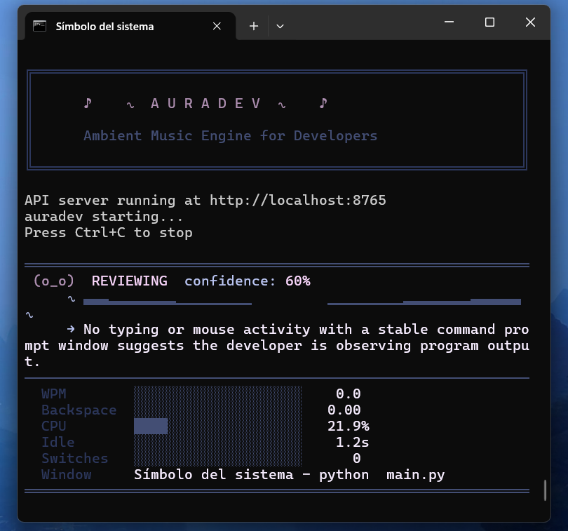
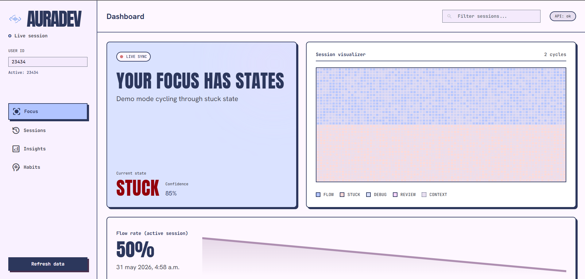

# auradev

Ambient music engine that samples developer behavioral telemetry every 30 seconds, classifies cognitive state via Claude, and plays procedurally generated music matching that state — all in pure Python, silently in the background.

## Features

- **Real-time Telemetry Collection**: Monitors keystrokes, mouse movement, window switching, and system metrics
- **AI-Powered State Classification**: Uses Claude to analyze developer behavior and classify cognitive states
- **Procedural Audio Generation**: Creates ambient music using pure Python synthesis (no audio files required)
- **Synthesized Drum Beats**: Each cognitive state has a unique rhythm pattern (kick, snare, hi-hat)
- **Session Logging**: Tracks your coding sessions with colored terminal output and detailed logs
- **Visual Dashboard**: ASCII art logo, state icons, waveform visualizer, and metrics display
- **Demo Mode**: Works offline for demonstrations and testing

## Screenshots

### Terminal dashboard

Live ASCII dashboard in the terminal while auradev runs — state classification, explanation, and telemetry metrics update every sample interval.



### Web dashboard

Browser-based session view at `http://localhost:8765` — focus state, session visualizer, and flow rate over time.



## Cognitive States

auradev recognizes five distinct developer cognitive states, each with its own sound and rhythm:

| State | Sound | BPM | Rhythm |
|-------|-------|-----|--------|
| **Flow** | C major pentatonic (bright) | 90 | Steady 4/4 groove |
| **Stuck** | A minor pentatonic (somber) | 60 | Sparse, glitchy |
| **Debugging** | D major pentatonic (focused) | 100 | Syncopated, analytical |
| **Reviewing** | F major pentatonic (low drone) | 70 | Minimal, meditative |
| **Context Switching** | G major pentatonic (open) | 110 | Busy, shifting |

## Installation

1. **Clone and navigate to the project:**
   ```bash
   cd auradev
   ```

2. **Create a Python 3.13 virtual environment (recommended):**
   ```bash
   py -3.13 -m venv .venv
   # Windows
   .venv\Scripts\activate
   # Mac/Linux
   source .venv/bin/activate
   ```

3. **Install dependencies:**
   ```bash
   pip install -r requirements.txt
   ```

4. **Set up environment variables:**
   ```bash
   cp ../.env.example .env
   # Edit .env and add your ANTHROPIC_API_KEY
   ```

## Usage

### Normal Mode (with Claude API)
```bash
python main.py
```
Requires `ANTHROPIC_API_KEY` in your environment.

### Demo Mode (offline)
```bash
python main.py --demo
```
Cycles through all states without requiring network access or API keys.

### Command Line Options

```bash
python main.py [OPTIONS]

Options:
  --demo              Run in demo mode (no API calls)
  --interval SECONDS  Sample interval (default: 30, demo: 5)
  --max-cycles N      Maximum cycles to run (default: unlimited)
  --no-drums          Disable drum beats (melody only)
  --drum-volume FLOAT Drum volume 0.0-1.0 (default: 0.4)
```

### Examples

```bash
# Quick demo with fast cycling
python main.py --demo --interval 3 --max-cycles 10

# Melody-only mode (no drums)
python main.py --demo --no-drums

# Louder drums
python main.py --demo --drum-volume 0.7
```

## Sample Output

```
╔══════════════════════════════════════════════════════════╗
║        ♪    ∿  A U R A D E V  ∿    ♪                     ║
║        Ambient Music Engine for Developers               ║
╚══════════════════════════════════════════════════════════╝

════════════════════════════════════════════════════════════
 ~[O]~  FLOW  confidence: 85%
     ∿ ▄▅▆▆▇▇▆▅▄▃▂▁▁  ▁▂▃▄▅▆▇▇▇▆▅▄▃▂▁ ∿
     → Steady typing with low backspace ratio
────────────────────────────────────────────────────────────
  WPM        ███████░░░░░░░░░░░░░   46.7
  Backspace  ██░░░░░░░░░░░░░░░░░░   0.08
  CPU        ████░░░░░░░░░░░░░░░░   21.4%
════════════════════════════════════════════════════════════
```

## State Icons

| State | Icon |
|-------|------|
| Flow | `~[O]~` |
| Stuck | `[???]` |
| Debugging | `[:*:]` |
| Reviewing | `(o_o)` |
| Context Switching | `<==>` |

## Project Structure

```
auradev/
├── main.py           # Main application entry point
├── collector.py      # Telemetry collection (keyboard, mouse, system)
├── classifier.py     # Claude API integration for state classification
├── audio.py          # Procedural audio + drum synthesis
├── logger.py         # Session logging with ANSI colors and visuals
├── config.py         # Configuration constants and chord mappings
├── requirements.txt  # Python dependencies
└── README.md         # This file
```

## Audio Design

auradev generates all audio procedurally using:
- **Layered oscillators**: Sine + triangle waves with harmonic overtones
- **ADSR envelopes**: 0.5s attack for pad-like sound
- **Tremolo & pulse LFO**: Subtle rhythmic movement synced to BPM
- **Synthesized drums**: Kick (pitch-dropping sine), snare (tone + noise), hi-hat (filtered noise)
- **State-specific patterns**: 16-step drum sequences unique to each cognitive state
- **Crossfading**: 3-second smooth transitions between states
- **Sub-bass enhancement**: Root/2 frequency for warmth
- **Stereo panning LFO**: Slow movement across the stereo field
- **Volume limiting**: Max 0.35 to stay background-appropriate

## Drum Patterns

Each state has a unique 16-step drum pattern:

- **Flow**: Classic 4/4 kick-snare-hat groove (productivity beat)
- **Stuck**: Sparse, irregular hits (reflecting uncertainty)
- **Debugging**: Syncopated kicks with busy hi-hats (problem-solving energy)
- **Reviewing**: Minimal kicks and occasional hats (meditative)
- **Context Switching**: Dense, shifting pattern (mental juggling)

## Requirements

- **Python 3.10+** (3.13 recommended for full audio support)
- **Operating System**: Windows, macOS, or Linux
- **Permissions**: Input monitoring access may be required for `pynput`
  - macOS: Grant Accessibility permissions when prompted
  - Linux: May need to run with appropriate permissions or add user to `input` group

## Session Logging

auradev creates detailed session logs including:
- Real-time colored terminal output with ASCII visualizations
- Persistent session file (`session.log`)
- Final session summary with state percentages
- Detection of longest continuous flow windows

## 🗄️ Data Storage

auradev supports two multi-tenant database modes for flexible deployment:

### Isolated Mode (Default)
Each user gets their own separate SQLite database file. Best for desktop apps and maximum privacy.

```bash
# Default mode - no configuration needed
python main.py
```

Database location: `~/.auradev/auradev_{hash}.db` where `{hash}` is derived from your user ID.

### Shared Mode
All users share a single database with automatic user filtering. Best for cloud deployments and centralized management.

```bash
export DB_MODE=shared
python main.py
```

Database location: `~/.auradev/auradev.db`

### Usage Examples

**Single user (default):**
```bash
# No configuration needed - works out of the box
python main.py
```

**Multi-user same machine:**
```bash
# User 1
export USER_ID=alice
python main.py

# User 2 (in different terminal)
export USER_ID=bob
python main.py
```

**Cloud deployment:**
```bash
# Set shared mode for multi-tenant server
export DB_MODE=shared
export DB_DIR=/var/auradev/data
uvicorn api:app --host 0.0.0.0 --port 8765
```

## Environment Variables

| Variable | Required | Default | Description |
|----------|----------|---------|-------------|
| `ANTHROPIC_API_KEY` | Yes* | - | Your Claude API key (*not required in --demo mode) |
| `DB_MODE` | No | `isolated` | Database mode: `isolated` or `shared` |
| `DB_DIR` | No | `~/.auradev` | Custom database directory path |
| `USER_ID` | No | system username | Override user identifier |
| `API_PORT` | No | `8765` | Port for web dashboard API |

**Example .env file:**
```bash
ANTHROPIC_API_KEY=sk-ant-api03-...
DB_MODE=isolated
USER_ID=developer1
```

## Demo Script

1. Start auradev: `python main.py --demo`
2. Watch the ASCII dashboard showing live state changes
3. Listen to audio and drum transitions between cognitive states
4. Stop with Ctrl+C to see session summary
5. Check `session.log` for detailed session data

## Troubleshooting

### Audio & Input Issues

**Input monitoring fails**: Grant accessibility permissions on macOS or run with appropriate privileges on Linux.

**pygetwindow errors**: Window tracking may fail on some systems - this is handled gracefully with fallbacks.

**Audio clicks/pops**: Ensure no other applications are competing for audio resources.

**No audio (Python 3.14+)**: pygame/numpy may not be available. Use Python 3.13 or earlier, or create a venv with the included `.venv`.

### API & Authentication Issues

**API errors**: Check your `ANTHROPIC_API_KEY` or use `--demo` mode for offline operation.

**Dashboard shows "Connecting" forever**: 
- Check API server is running: `uvicorn api:app --reload`
- Verify port 8765 is accessible: `curl http://localhost:8765/api/health`
- Check browser console for CORS or network errors

**401 Unauthorized / User not found**: Set `USER_ID` environment variable or include `X-User-Id` header in API requests.

### Database & Multi-User Issues

**"No such column: user_id" error**: 
- Your database needs migration
- See docs/multi-tenant-database.md for migration instructions
- Or delete `~/.auradev/*.db` to start fresh

**Users seeing each other's data**:
- Verify `DB_MODE=shared` is set in your environment
- Check that API calls include the `X-User-Id` header
- Run integration tests: `python test_multiuser.py`

**Database file not found**:
- Check `DB_DIR` environment variable is set correctly
- Ensure the directory exists and has write permissions
- Default location is `~/.auradev/`

**Different data in dashboard vs main app**:
- Both should use same `DB_MODE` and `USER_ID`
- Check environment variables are set consistently
- In isolated mode, each user_id creates a separate database file

## Architecture

Five modules communicate via plain Python dictionaries:

```
collector.py  →  classifier.py  →  audio.py
                      ↓
                 logger.py
```

Data flows from telemetry collection through AI classification to audio generation and logging, with robust error handling at each stage.

## License

MIT License - Built for Platanus Build Night
